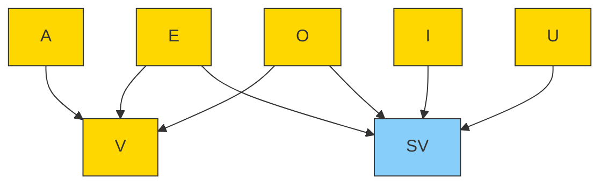

# Fonologia

### 1. Fonema
Fonema é o som emitido ao falar palavras.

- Casa => `K-A-Z-A`

---

### 2. Nem toda letra tem som
Algumas letras têm mais de um som.

- Hoje => `O-J-E`  
- Máximo => `M-A-K-S-I-M-O`

---

### 3. Casos de Letras vs Fonemas

!!! tip "3.1 Letras = Fonemas"
    | Palavra | Letras | Fonemas |
    |---------|--------|---------|
    | Casa    | 4      | 4       |
    | Livro   | 5      | 5       |

!!! tip "3.2 Letras > Fonemas"
    | Palavra | Letras | Fonemas |
    |---------|--------|---------|
    | Hora    | 4      | 3       |
    | Guerra  | 6      | 4       |

!!! tip "3.3 Letras < Fonemas"
    | Palavra | Letras | Fonemas |
    |---------|--------|---------|
    | Tóxico  | 6      | 7       |
    | Fixo    | 4      | 5       |

---

### 4. Mesma letra pode representar mais de um fonema
- Curso => `C-U-R-**S**-**S**-O`  
- Casa  => `C-U-R-**Z**-O`  

> Observação: a mesma letra **S** tem som de **Z** em *Casa* e som de **SS** em *Curso*.

---

### 5. Digráfos
Digráfo é quando duas letras possuem o som de uma.

#### 5.1 Digráfos sempre ou nem sempre

| Digráfos sempre | Digráfos nem sempre |
|-----------------|-------------------|
| ch              | sc                |
| lh              | x                 |
| nh              | gu                |
| rr              | qu                |
| sç              |                   |
| xc              |                   |
| ss              |                   |

!!! info "Dica"
    Para encontrar fonemas:  
    **Letras - Dígrafos = Fonemas**

**Exemplos:**

| Palavra       | Letras | Digráfos | Fonemas |
|---------------|--------|----------|---------|
| Cachorrinho   | 11     | 3        | 8       |
| Ilha          | 4      | 1        | 3       |

---

#### 5.2 Digráfo Nasal e Vocálico

- **Hiato**: separação de duas vogais.
- **Ditongo**: não separação de duas vogais.
    - Crescente: Semivogal → Vogal
    - Decrescente: Vogal → Semivogal

### Exemplos de Ditongos e Tritongos

| Palavra  | Decomposição | Tipo                   | Observação                      |
|----------|-------------|-----------------------|---------------------------------|
| Foram    | `F-O-R-A-O` | Ditongo Nasal         | "am" tem som de ão              |
| Refém    | `R-E-F-E-I-M` | Ditongo Decrescente Nasal | "ei" → Vogal → Semivogal     |
| PA-RA-GUAI | `P-A-R-A-G-U-A-I` | Tritongo Oral      | Semivogal → Vogal → Semivogal   |
| SA-GÃUO  | `S-A-G-Ã-U-O` | Tritongo Nasal       | Semivogal → Vogal → Semivogal   |

---

### 6. Encontros Consonantais

| Palavra        | Classificação         |
|----------------|---------------------|
| L I V R O      | c v **c c** v       |
| P R O B L E M A| **c c** v **c c** v c v |

> Nota: `c` = consoante, `v` = vogal

